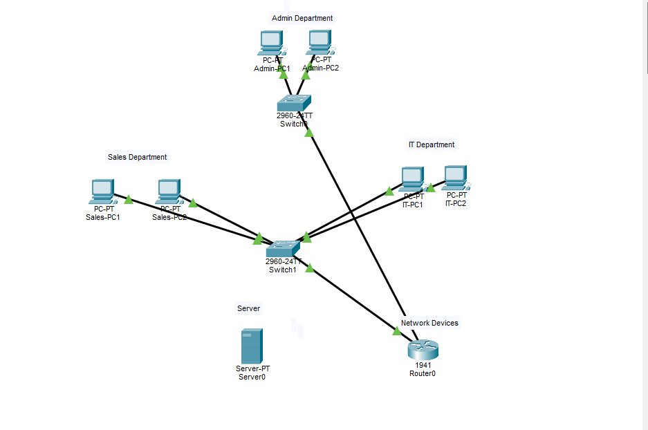

# Small Business Network

## Network Topology

## Project Overview

This project simulates a small business using Cisco Packet Tracer.

The network coints three departmendts:

- Admin
- Sales
- IT

The objective is to separate the departments using VLANs and allow communicatior between them using inter-VLAN routing.

## Network Devices

- 1 Router
- 2 Switches
- 6 PCs
- 1 Server

## VLANs

| VLAN | Department | Netwrok |
|-------|-----------|---------|
| 10 | Admin | 192.168.10.0/24 |
| 20 | Sales | 192.168.20.0/24 |
| 30 | IT | 192.168.30.0/24 |

## Technologies Used

- Cisco Packet Tracer
VLANs 
- IPv4
- Inter-VLAN Routing
- Cisco IOS CLI

## Current Progress

- Netwrok topology created
- VLANs configured 
- Switch ports assigned
- Router subinterfaces
- Static IP addresses configured
- Connectivity tested successfully

## DHCP

The router was configured as a DHCP for all three VLANs.

Each department automatically receives:
- IP address
- Subnet mask
- Default gateway

## Security

AN extended ACL was configured to block the SALES network from accessing the ADMIN network.

SALES is still allowd to communicate with the IT network.

## Testing

Connectivity was tested suing ping commands.

The following tests were successful:
- Communication inside the same VLAN
- Inter-VLAN communication
- DHCP address assignment
- ACL blocking between SALES and ADMIN

## Troubleshooting

During the project, the GigabitEthernet0/0 interface was administratively down.

The issue was resolved using the `no shutdown` command.

## What I Learned

In this project I learned how to:

- Create and configure VLANs
- Assign switch ports to VLANs
- Configure inter-VLAN routing
- Configure DHCP
- Use extended ACLs
- Test network connectivity
- Troubleshoot Cisco network configuration issues

## Project Status

Completed 